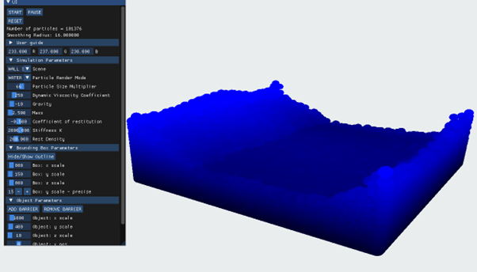
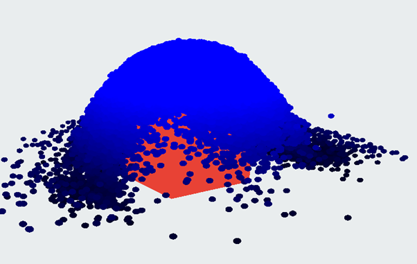

# SPH
A real time, GPU-based, luid simulation using smooth particle hydrodynamics done as a solo project for my Computer Animation (COMP 6311) class in Concordia University, Montreal.

The project is written in c++ and the rendering is done using OpenGl, all SPH computations occur in the GPU through the use of compute shaders.

### External Libraries Used
- GLFW
- Glad
- ImGui

### Functionality

#### Parameter Tuning
Through the ImGui UI the user can manipulate the parameters of the SPH simulation.
These parameters include the dynamic viscocity coefficient, the number of particles and more.
Warning, at the extremes the parameters become unstable and may result in unexpected behavior.

#### Bounding Box Tuning
The scale of the bounding box can be manipulated in real time, the outline can also be toggled on or off

#### Object Tuning
An object can also be added to the scene, this object can collide with the smoothed particles and multiple
object configurations can be explored

### References and Attributions

#### LearnOpenGL
The camera, shader, and compute shader class used in this project are taken from the OpenGl tutorial series LearnOpenGL.
The classes have been slightly modified to provide functionality specific to my use case.
https://learnopengl.com/Getting-started/Camera
https://learnopengl.com/Getting-started/Shaders
https://learnopengl.com/Guest-Articles/2022/Compute-Shaders/Introduction

#### OpenGlTutorial
The following learn-opengl tutorial was used to guide my implementation of the billboarded spheres used for rendering.
http://www.opengl-tutorial.org/intermediate-tutorials/billboards-particles/billboards/

#### Fluid Engine Development
The following book by doyub-kim was used to learn about smooth particle hydrodynamics and the smoothing kernels used in this project
are taken directly from this source.
Kim, D. (2017). Fluid Engine Development (1st ed.). A K Peters/CRC Press. https://doi.org/10.1201/b22137
